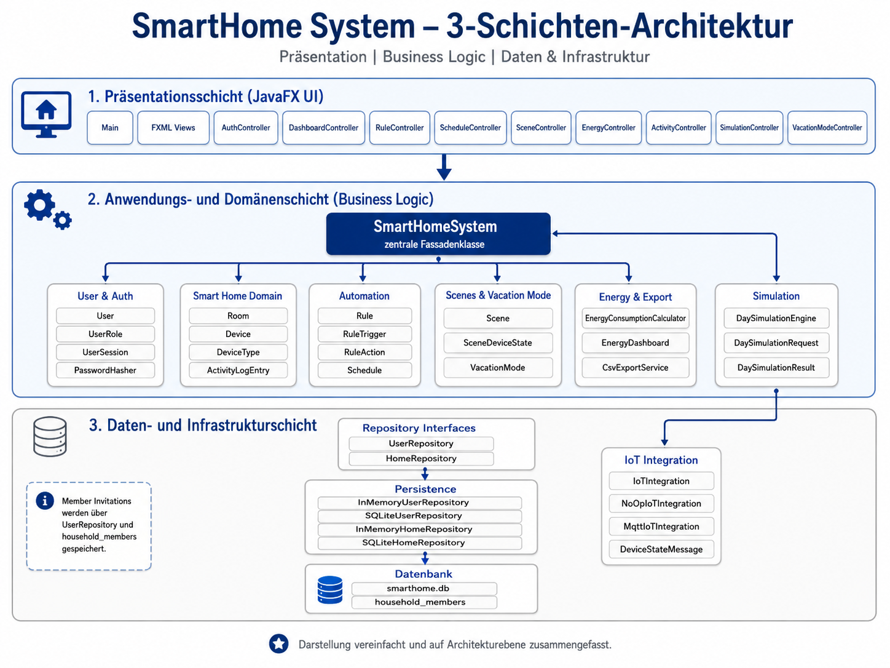
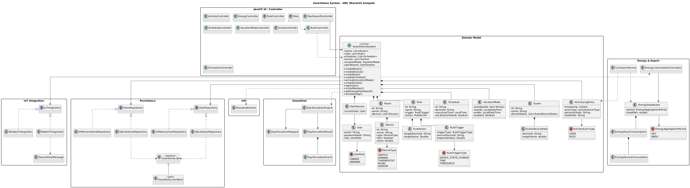
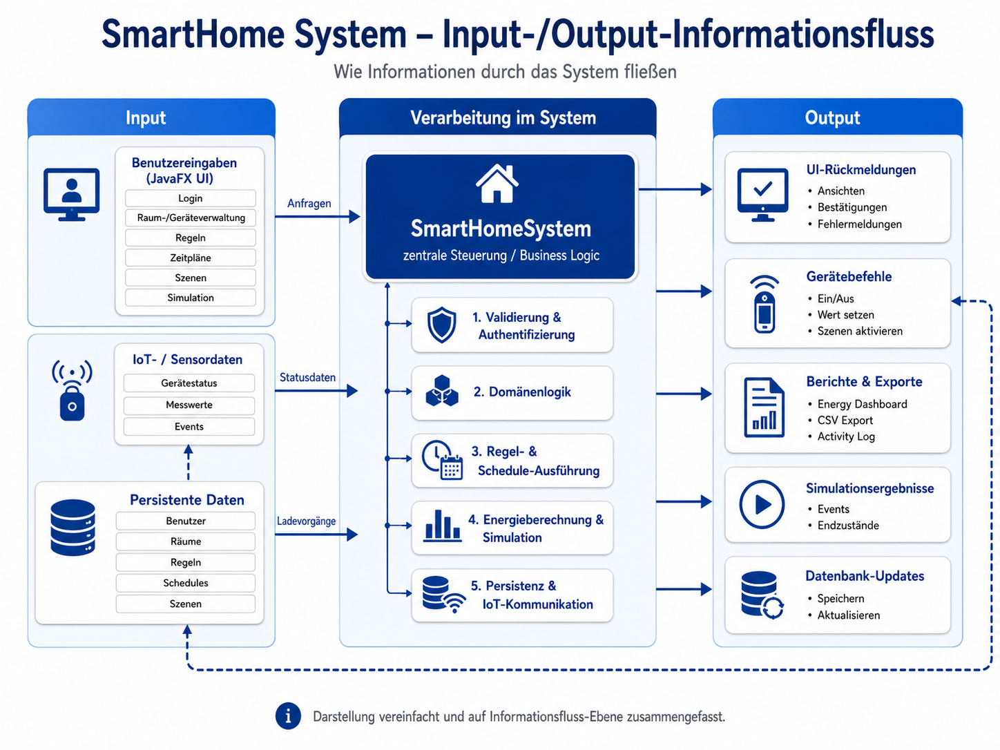

# Systemdokumentation

## Überblick

Das System ist eine JavaFX-basierte Smart-Home-Anwendung zur Verwaltung von Geräten, Räumen, Zeitplänen, Regeln, Szenen, Energieverbrauch, Simulationen, IoT-Integration und Benutzerrollen.

Die Anwendung ermöglicht es Benutzern, Räume und Geräte anzulegen, Gerätezustände zu ändern, Regeln und Zeitpläne zu definieren, Szenen zu aktivieren, Energieauswertungen anzuzeigen und CSV-Exporte zu erzeugen. Zusätzlich unterstützt das System Benutzerregistrierung, Login, Rollenrechte sowie die Einladung von Mitgliedern.

Zentrale Funktionen des Systems sind:

* Benutzerregistrierung und Login
* Rollenverwaltung mit `OWNER` und `MEMBER`
* Einladung von Mitgliedern
* Verwaltung von Räumen und Geräten
* Steuerung von Geräten und Gerätezuständen
* Erstellung und Ausführung von Regeln
* Erstellung und Ausführung von Zeitplänen
* Verwaltung von Szenen
* Vacation Mode
* Energieauswertung und CSV-Export
* Tagessimulation von Smart-Home-Abläufen
* IoT-Integration
* Persistenz über In-Memory- und SQLite-Repositories

## Allgemeine Systemarchitektur

Das System ist um die zentrale Klasse `SmartHomeSystem` aufgebaut. Diese Klasse dient als zentrale Fassadenklasse und bündelt die wichtigsten Funktionen der Anwendung. Die JavaFX-Controller greifen überwiegend über `SmartHomeSystem` auf die Geschäftslogik zu.

Die allgemeine Systemarchitektur besteht aus mehreren zusammenarbeitenden Bereichen:

* JavaFX UI
* Benutzer und Sicherheit
* Smart Home Domain
* Automatisierung
* Energy & Export
* Simulation
* Persistenz und Infrastruktur

## Architektur

Die Anwendung ist schichtenorientiert aufgebaut. UI, Logik und Datenzugriff sind getrennt, damit Funktionen leichter getestet, erweitert und gewartet werden können.

* UI: JavaFX mit FXML-Views und Controllern
* Domänenlogik: Klassen im Package `model`
* Datenzugriff: Repository-Schnittstellen und Implementierungen im Package `repository`
* IoT-Integration: Klassen und Schnittstellen im Bereich `iot`
* Hilfsklassen: z. B. `PasswordHasher`
* Startpunkt: `Main.java`

Die Architektur kann in drei zentrale Schichten unterteilt werden:

### Präsentationsschicht

Die Präsentationsschicht besteht aus JavaFX, FXML-Views und den zugehörigen Controllern. Sie ist für die Interaktion mit dem Benutzer zuständig. Eingaben aus der Oberfläche werden an die zentrale Anwendungslogik weitergeleitet.

Beispiele für Komponenten dieser Schicht sind:

* `Main`
* FXML Views
* `AuthController`
* `DashboardController`
* `RuleController`
* `ScheduleController`
* `SceneController`
* `EnergyController`
* `ActivityController`
* `SimulationController`
* `VacationModeController`

### Anwendungs- und Domänenschicht

Die Anwendungs- und Domänenschicht enthält die zentrale Geschäftslogik. Im Mittelpunkt steht die Klasse `SmartHomeSystem`. Sie koordiniert Räume, Geräte, Regeln, Zeitpläne, Szenen, Simulationen, Energieauswertungen und Benutzeraktionen.

Wichtige Bestandteile dieser Schicht sind:

* Benutzer- und Rollenlogik
* Raum- und Geräteverwaltung
* Regel- und Schedule-Ausführung
* Szenenverwaltung
* Vacation Mode
* Energieauswertung
* Simulation

### Daten- und Infrastrukturschicht

Die Daten- und Infrastrukturschicht kapselt Persistenz und externe Schnittstellen. Der Datenzugriff erfolgt über Repository-Schnittstellen. Dadurch kann zwischen verschiedenen Speicherarten gewechselt werden, ohne die zentrale Domänenlogik direkt verändern zu müssen.

Wichtige Bestandteile dieser Schicht sind:

* `UserRepository`
* `HomeRepository`
* `InMemoryUserRepository`
* `SQLiteUserRepository`
* `InMemoryHomeRepository`
* `SQLiteHomeRepository`
* `smarthome.db`
* `household_members`
* `IoTIntegration`
* `MqttIoTIntegration`
* `NoOpIoTIntegration`

Member Invitations werden nicht als eigene Domänenklasse modelliert, sondern über `UserRepository` und die Tabelle `household_members` gespeichert.

## UML-Übersicht

Die UML-Übersicht stellt die wichtigsten Klassen und Beziehungen des Systems kompakt dar. Sie zeigt die zentrale Rolle von `SmartHomeSystem` sowie die Verbindung zu Controllern, Domänenklassen, Repositories, IoT-Komponenten, Energieauswertung und Simulation.

Da das Projekt aus vielen Klassen besteht, ist das UML-Diagramm bewusst als kompakte Architekturübersicht dargestellt. Es zeigt nicht jede einzelne Methode, sondern konzentriert sich auf die wichtigsten Strukturen und Abhängigkeiten.

Wichtige Bereiche im UML-Diagramm sind:

* JavaFX UI / Controller
* Domain Model
* Persistence
* IoT Integration
* Energy & Export
* Simulation
* Utility-Klassen

## Informationsfluss im System

Der Informationsfluss im System folgt grundsätzlich dem Muster Eingabe, Verarbeitung und Ausgabe.

Benutzereingaben entstehen in der JavaFX-Oberfläche. Dazu gehören zum Beispiel Login, Raum- und Geräteverwaltung, Regeln, Zeitpläne, Szenen und Simulationen. Diese Eingaben werden an `SmartHomeSystem` weitergeleitet und dort validiert, verarbeitet und gegebenenfalls gespeichert.

Zusätzlich verarbeitet das System IoT- und Sensordaten. Diese können Gerätestatus, Messwerte oder Events darstellen. Persistente Daten werden aus den Repositories beziehungsweise aus der SQLite-Datenbank geladen und nach Änderungen wieder gespeichert.

Die wichtigsten Verarbeitungsschritte sind:

1. Validierung und Authentifizierung
2. Domänenlogik
3. Regel- und Schedule-Ausführung
4. Energieberechnung und Simulation
5. Persistenz und IoT-Kommunikation

Die Ausgaben des Systems bestehen aus UI-Rückmeldungen, Gerätebefehlen, Berichten, Exporten, Simulationsergebnissen und Datenbank-Updates.

Beispiele für Outputs sind:

* aktualisierte Ansichten in der JavaFX-Oberfläche
* Bestätigungen und Fehlermeldungen
* Gerätebefehle wie Ein/Aus oder Wert setzen
* aktivierte Szenen
* Energy Dashboard
* CSV-Export
* Activity Log
* Simulationsergebnisse
* gespeicherte Änderungen in der Datenbank

## Wichtige Designentscheidungen

### Zentrale Fassadenklasse

Die Klasse `SmartHomeSystem` wurde als zentrale Fassadenklasse gestaltet. Dadurch haben die Controller eine einheitliche Schnittstelle zur Geschäftslogik. Die Benutzeroberfläche muss nicht direkt mit einzelnen Repositories oder vielen verschiedenen Domänenklassen arbeiten.

Vorteile dieser Entscheidung sind:

* geringere Kopplung zwischen UI und Datenzugriff
* bessere Strukturierung der Geschäftslogik
* leichtere Erweiterbarkeit
* bessere Testbarkeit der Kernfunktionen

### Trennung von UI, Logik und Persistenz

Die Anwendung trennt JavaFX-Controller, Domänenlogik und Datenzugriff. Dadurch kann die Geschäftslogik unabhängig von der grafischen Oberfläche getestet werden. Gleichzeitig kann die Persistenz ausgetauscht oder erweitert werden, ohne die UI direkt zu verändern.

### Repository-Muster

Der Datenzugriff erfolgt über Repository-Schnittstellen wie `UserRepository` und `HomeRepository`. Konkrete Implementierungen sind unter anderem In-Memory- und SQLite-Repositories.

Dadurch unterstützt das System unterschiedliche Speicherarten:

* In-Memory-Speicherung für Tests oder temporäre Daten
* SQLite-Speicherung für persistente Datenhaltung

### Rollenmodell

Das System unterscheidet zwischen den Rollen `OWNER` und `MEMBER`. Dadurch können Benutzerrechte differenziert behandelt werden. Zusätzlich können Mitglieder eingeladen und einem Haushalt zugeordnet werden.

### Erweiterbare IoT-Integration

Die IoT-Kommunikation ist über Schnittstellen abstrahiert. Dadurch kann das System mit einer No-Op-Integration betrieben oder über MQTT-nahe Komponenten erweitert werden. Diese Struktur erleichtert spätere Erweiterungen für reale Smart-Home-Geräte.

## Erweiterungspunkte

* Neue Gerätetypen ergänzen, z. B. Kamera, Heizung oder Lautsprecher
* Neue Regeltypen und Trigger hinzufügen
* Weitere Auswertungen ergänzen, z. B. Energieverbrauch pro Monat
* Ausbau der IoT-Integration für reale Smart-Home-Geräte
* Zusätzliche Speicherarten einbauen, z. B. Cloud- oder Remote-Datenbank
* Weitere Tests ergänzen, wenn neue Funktionen dazukommen
* UI-nahe Tests ergänzen

## Build und Qualität

* Build-Tool: Maven
* Tests: JUnit
* Statische Analyse: PMD
* Testabdeckung: 84,2 % ohne UI-Klassen

Maven übernimmt das Kompilieren des Projekts, die Verwaltung von Abhängigkeiten und die Ausführung automatisierter Tests. Für automatisierte Tests wird JUnit verwendet. Zusätzlich wird PMD für statische Codeanalyse eingesetzt, um Codequalität und potenzielle Problemstellen zu prüfen.

UI-Klassen sind nicht vollständig automatisiert getestet, da sie stark an JavaFX und FXML gebunden sind. Der Fokus der automatisierten Tests liegt daher auf der Geschäftslogik, Persistenz, Regeln, Zeitplänen, Simulation, Energieauswertung und IoT-nahen Komponenten.

## Testfallbeschreibung und Testabdeckung

Die Tests prüfen zentrale Funktionen wie:

* Benutzerregistrierung und Login
* Rollenrechte
* Raumverwaltung
* Geräteverwaltung
* Gerätezustände
* Regeln und Trigger
* Zeitpläne und Schedule-Ausführung
* Konflikterkennung
* Szenen
* Vacation Mode
* Energieauswertung
* CSV-Export
* Simulation
* IoT-Integration
* Persistenz über Repositories

Aktuelle Testabdeckung:

* 84,2 % ohne UI-Klassen

Die Testabdeckung zeigt, dass ein großer Teil der fachlichen Kernlogik automatisiert geprüft wird. Die UI-nahe Logik ist bewusst weniger stark durch Unit-Tests abgedeckt, da JavaFX-Komponenten häufig stärker von manuellen oder UI-spezifischen Tests abhängig sind.

## Bekannte Einschränkungen

* UI-Klassen sind nicht vollständig automatisiert getestet.
* Reale Smart-Home-Hardware ist nicht zwingend angebunden.
* Die IoT-Integration ist strukturell vorbereitet, aber je nach Konfiguration nicht vollständig real angebunden.
* Die grafische Oberfläche ist an JavaFX und FXML gebunden.
* Komplexe Regelketten oder Prioritäten sind nur begrenzt abgebildet.
* Die Energieauswertung ist auf die implementierten Aggregationslogiken beschränkt.

## Fazit

Das SmartHome System ist schichtenorientiert aufgebaut und trennt Benutzeroberfläche, Geschäftslogik und Datenzugriff klar voneinander. Die zentrale Klasse `SmartHomeSystem` dient als Fassadenklasse und verbindet die wichtigsten Funktionen des Systems.

Durch Repository-Schnittstellen, getrennte Domänenklassen, automatisierte Tests, PMD-Analyse und eine strukturierte Architektur ist das Projekt wartbar und erweiterbar. Die wichtigsten Smart-Home-Funktionen wie Raum- und Geräteverwaltung, Regeln, Zeitpläne, Szenen, Vacation Mode, Energieauswertung, CSV-Export, Simulation und IoT-Integration sind abgedeckt.

Die aktuelle Testabdeckung von 84,2 % ohne UI-Klassen zeigt, dass die fachliche Kernlogik umfangreich automatisiert geprüft wird. Für zukünftige Releases bieten sich insbesondere Erweiterungen bei echten IoT-Geräten, erweiterten Regeln, zusätzlichen Auswertungen und UI-nahen Tests an.
